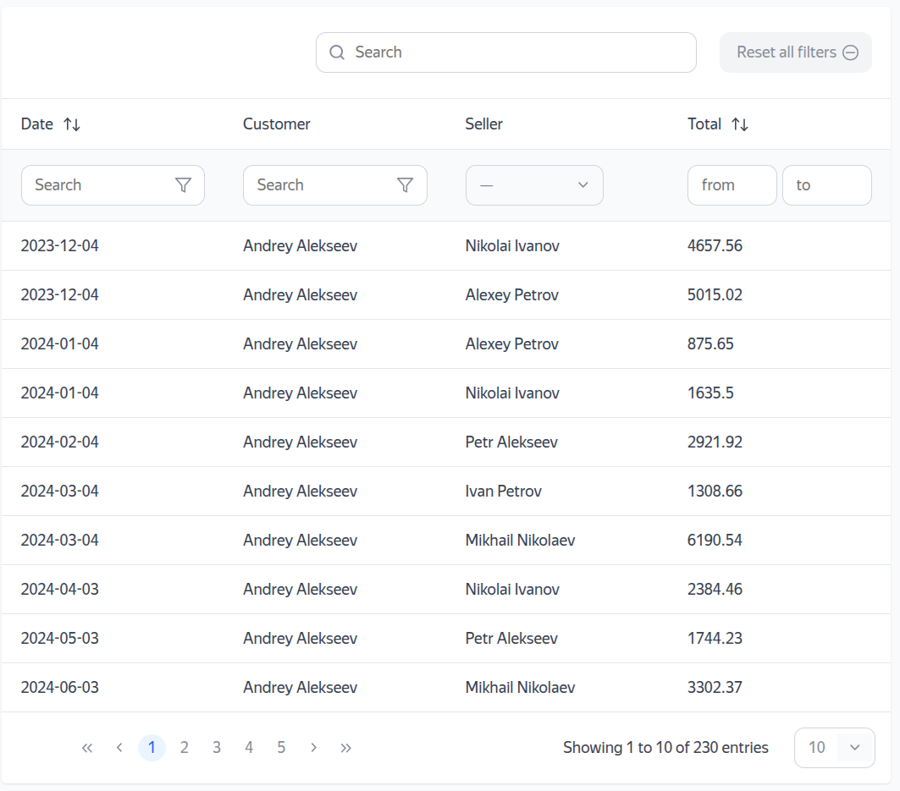
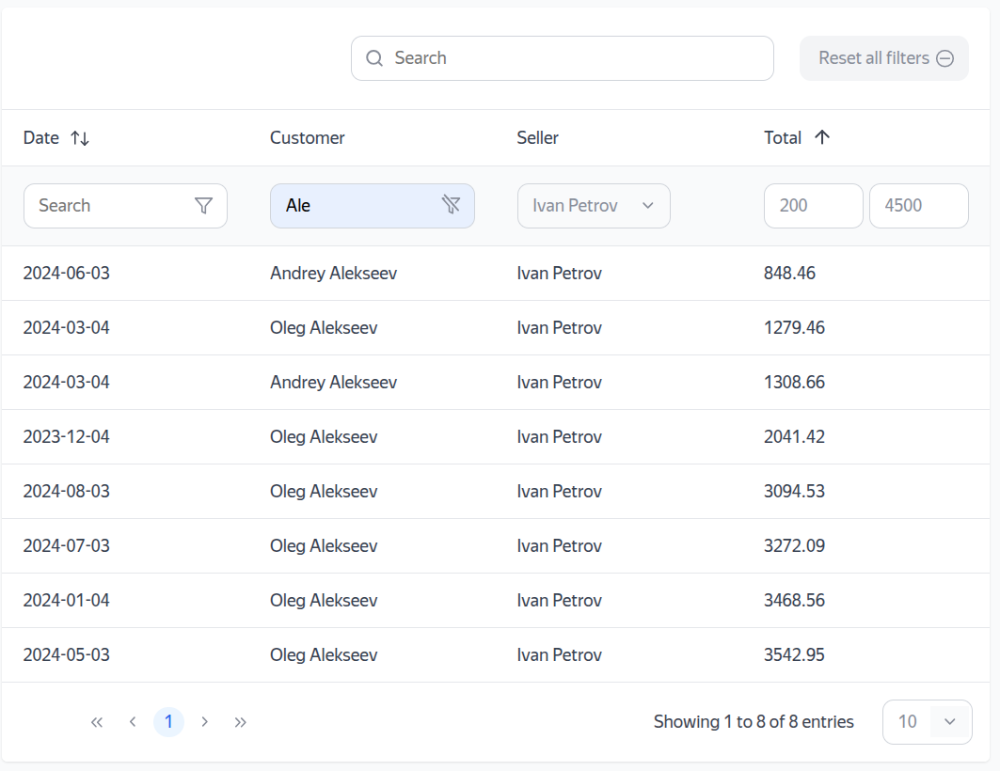

https://github.com/lamayade/smart-table.git
https://github.com/Lamayade/smart-table
# Умная таблица
## Сайт с динамической таблицей продаж
Содержит данные о дате продажи, покупателе, продавце и сумме продажи.

## Возможности
Реализован поиск по дате, продавце и покупателе.
Реализована возможность сортировки по дате, продавцу и сумме продажи.
Реализована возможность фильтрации по дате и покупателю.
Реализована пагинация по записям.


## Технологии
JavaScript
HTML
CSS
Vite

## Как развернуть проект локально
Форкнуть и клонировать репозиторий:

```bash
git clone https://github.com/ваш_логин_на_гитхабе/smart-table.git
```

Перейти в папку проекта:

```bash
cd smart-table
```

Установить зависимости и запустить локальный веб-сервер:

```bash
npm install
npm run dev
```

Перейти по адресу `http://localhost:5173/` (или по выведенному в консоль адресу) в браузере.

## Скриншоты

